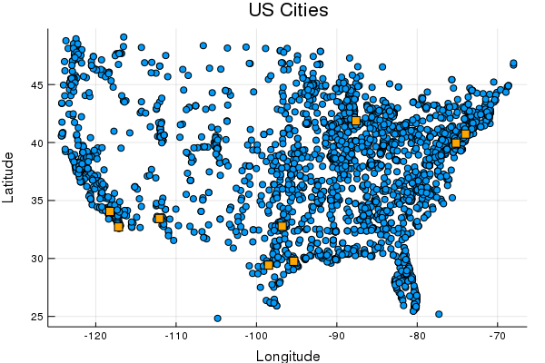
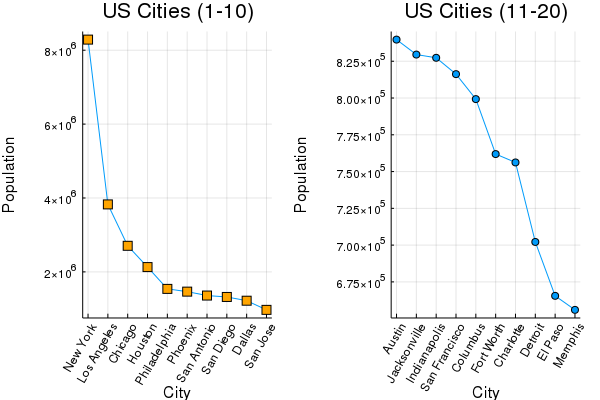

# jules – Playground for Julia experiments

Here's a simple import of a CSV file using the `Tony` module's exported
`cities()` function and a test plot using the `plotcities()` function.

See also these couple links to the
[DataFrames.jl](https://juliadata.github.io/DataFrames.jl/stable/index.html)
and
[CSV.jl](https://juliadata.github.io/CSV.jl/stable/index.html)
documentation pages.

Note that best shot for Postgres support right now seems to be [LibPQ.jl](https://github.com/invenia/LibPQ.jl) –
a Julia wrapper for the PostgreSQL libpq C library.


```
% julia --project
               _
   _       _ _(_)_     |  Documentation: https://docs.julialang.org
  (_)     | (_) (_)    |
   _ _   _| |_  __ _   |  Type "?" for help, "]?" for Pkg help.
  | | | | | | |/ _` |  |
  | | |_| | | | (_| |  |  Version 1.0.3 (2018-12-18)
 _/ |\__'_|_|_|\__'_|  |  Official https://julialang.org/ release
|__/                   |

julia> using Tony
[ Info: Recompiling stale cache file /Users/tony/.julia/compiled/v1.0/Tony/iHaKB.ji for Tony [d8886264-044d-11e9-15c8-31bd3d336b1a]

julia> cities()
3228×4 DataFrames.DataFrame
│ Row  │ name                    │ population │ latitude │ longitude │
│      │ Union{Missing, String}  │ Int64⍰     │ Float64⍰ │ Float64⍰  │
├──────┼─────────────────────────┼────────────┼──────────┼───────────┤
│ 1    │ New York                │ 8287238    │ 40.7306  │ -73.9866  │
│ 2    │ Los Angeles             │ 3826423    │ 34.0537  │ -118.243  │
│ 3    │ Chicago                 │ 2705627    │ 41.8756  │ -87.6244  │
│ 4    │ Houston                 │ 2129784    │ 29.7589  │ -95.3677  │
│ 5    │ Philadelphia            │ 1539313    │ 39.9523  │ -75.1638  │
...
│ 3224 │ Spanish Fort            │ 7102       │ 30.6749  │ -87.9153  │
│ 3225 │ Plaquemine              │ 7102       │ 30.2891  │ -91.2343  │
│ 3226 │ Milton-Freewater        │ 7102       │ 45.9326  │ -118.388  │
│ 3227 │ Benton                  │ 7096       │ 36.0345  │ -88.1013  │
│ 3228 │ Ocean City              │ 7094       │ 39.2776  │ -74.5746  │

julia> names(cities())
4-element Array{Symbol,1}:
 :name      
 :population
 :latitude  
 :longitude

julia>
```

And we can try this out with this `plotcities()` function:

```julia
function plotcities()
    # read cities into a dataframe
    df = cities()
    df1 = filter(row -> row[:population] > 1_000_000, df)
    df2 = filter(row -> row[:population] <= 1_000_000, df)
    # scatter plot of lat/long - for df2 cities (below 1m pop.)
    scatter(df2[:longitude], df2[:latitude],
    title = "US Cities",
    xlabel = "Longitude",
    ylabel = "Latitude",
        legend = false,
        markershape = :circle,
        markercolor = :auto
        # markersize = 4
        )
    # scatter plot of lat/long - for df1 cities (above 1m pop.)
    scatter!(df1[:longitude], df1[:latitude],
        legend = false,
        markershape = :rect,
        markercolor = :orange
        # markersize = 4
        )
    savefig("images/plotcities-latlong.png")

    # line plots with layout
    c = df[1:10, :]
    d = df[11:20, :]
    p1 = plot([c[:population]],
        title = "US Cities (1-10)",
        xlabel = "City",
        ylabel = "Population",
        xticks = (1:10, c[:name]),
        xrotation = 60,
        legend = false,
        markershape = :rect,
        markercolor = :orange
        )
    p2 = plot([d[:population]],
        title = "US Cities (11-20)",
        xlabel = "City",
        ylabel = "Population",
        xticks = (1:10, d[:name]),
        xrotation = 60,
        legend = false,
        markershape = :auto,
        markercolor = :auto
        )
    plot(p1,p2,layout=2,legend=false)
    savefig("images/plotcities-layout.png")
end
```

This gives the following plots: a) a scatter plot of US city lat/long positions, and b) line plots for US city population distribution
which is comprised of two subplots using the `layout` composition:

### a) Lat/Long


### b) Layout

